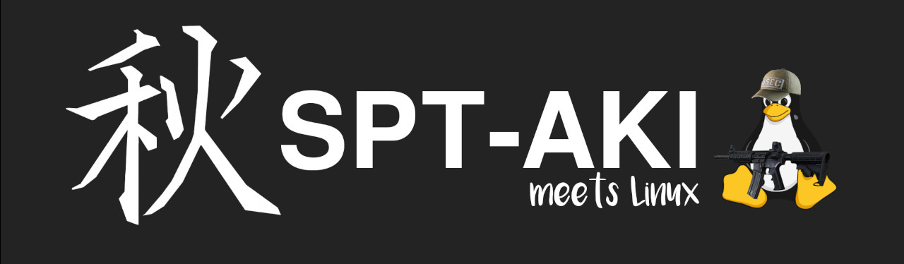

</img>

# SPT on Linux - Installation guide

Here you can find everything you need to install & play SPT-AKI on Linux.

You want to play on Windows instead? Check out the [offical SPT-AKI Installer](https://hub.sp-tarkov.com/files/file/672-spt-aki-installer/)!

## Bug reports
❗ This guide has been written by the SPT community and is **NOT** officially supported by the SPT developers. ❗

If you encounter an issue while playing SPT on Linux, do **NOT** report it to the dev's unless you're 100% sure it affects Windows installations as well. If possible, verify the issue on a Windows installation of the mod before reporting it.

## Overview

### Automated install
- [Lutris installer](docs/lutris_installer.md) (experimental)

### Manual install
- [Using Lutris](docs/lutris_guide.md)
- [Using Bottles](docs/bottles_guide.md)

### [FAQ](docs/faq.md)

### [Troubleshooting](docs/issues.md)

## Contributions
If you want to contribute to the guide, feel free to:
- Send us a [pull request](https://dev.sp-tarkov.com/MadByte/Linux-Guide/pulls)
- Open a [new issue](https://dev.sp-tarkov.com/MadByte/Linux-Guide/issues/new)
- Contact us on [Discord](https://discord.com/invite/Xn9msqQZan)

If you want to send us a PR, please make sure the formatting of your addition matches the existing content in our guide.

## Find us on Discord
Check out the offical [SPT-AKI Discord server](https://discord.com/invite/Xn9msqQZan)!

## Credits
Guide contributors:
- **APoorDev**
- **dj3hac**
- **Laserpulse**
- **LinuxFromMars**
- **MadByte**
- **nyuware**
- **Penkov**
- **TheSpectator**

