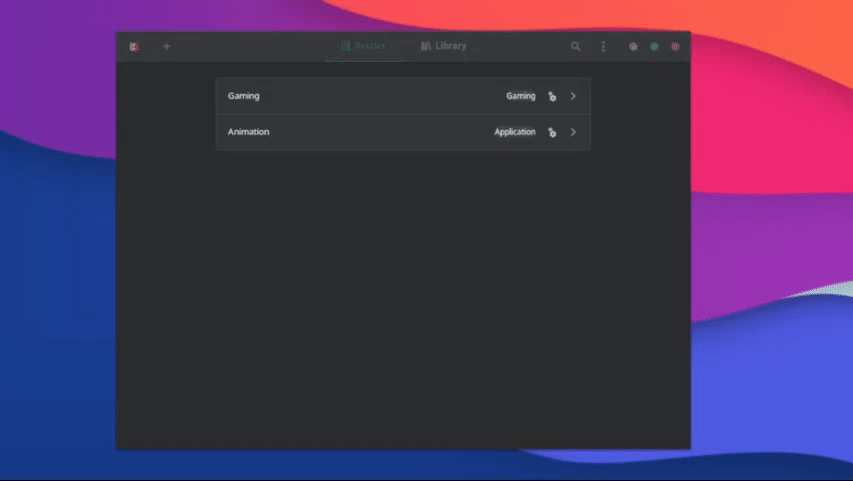

# SPT-AKI installation using Bottles

> **_NOTE:_**  Never install SPT-AKI into your live EFT's game directory!

## What you need

- ~90GB free disk space
- [Bottles](https://usebottles.com/)
    -
    - Make sure you have all your [wine dependencies](https://github.com/lutris/docs/blob/master/WineDependencies.md) installed.
    - Make sure GPU and vulkan drivers are installed and working.
- [SPT-AKI mod](https://hub.sp-tarkov.com/files/file/16-spt-aki/) (*.7z archive)
    -
    - Make sure to get the correct `SPT-AKI` mod archive for your EFT version! If there's no supported version, follow the [downpatching guide](./downpatching.md).

- [BSG Launcher](https://prod.escapefromtarkov.com/launcher/download/) (*.exe installer)
    -
- [.NET Desktop Runtime 8.x](https://dotnet.microsoft.com/en-us/download/dotnet/thank-you/runtime-desktop-8.0.3-windows-x64-installer?cid=getdotnetcore) (*.exe installer)
    -
    -**Workaround**: Bottles does not yet provide `dotnetdesktopcore8`

## Installation

**
TL;DR version
** 

1. Install new runner `wine-ge-proton`
2. Create new bottle using the `Gaming` preset
3. Install `dotnet48` and `vcredist2019` from the `Dependencies` section
4. Download and install `.Net Desktop Runtime 8.x` manually
5. In `Settings`, select `wine-ge-proton` as runner for the bottle
6. In `Settings` → `DLL Overrides`, add `winhttp` as `Native, then Builtin`
7. In `Settings`, set `Windows Version` to `Windows 8.1`
8. `Run Executable` and install the launcher
9. Install the game
10. Click on the three dots at the top right, then `Browse files`
11. Copy `EFT game files` somewhere else inside the bottle and `downpatch` if needed
12. Unpack the `RELEASE-SPT-x.x.x.zip` archive into the `copied directory`
13. In bottles click `Add Shortcuts` for `Aki.Server` and `Aki.Launcher`
14. Run `SPT Server` in terminal mode, then the `SPT Launcher`
15. Set correct path in `Aki.Launcher` settings (e.g `C:/SPTarkov`)

***
**1. Install Runner**

- First thing on the menu is to install a new runner. To do so open Bottles and select the `Main Menu` button in the top right and navigate to the `Runners` tab. Here you can install the latest `wine-ge-proton` runner.

**2. New Bottle**

- Now we need to set up a new bottle to install EFT. Click on the `+` symbol at the top left. In the `Environment` section select `Gaming`, give it a name and click `Create` at the top right of the window.

    

**3. Setting the bottle up**

- Once your bottle is done, we have to configure it. Navigate to the `Settings` tab and select `wine-ge-proton` as `Runner` for the bottle.

-  Then go to `Dependencies` and install `dotnet48` and `vcredist2019` (they might take a bit).

    
    
- Click `Run Executable` and install `.Net Desktop Runtime 8.x` manually

- look for the `DLL Overrides` section and add `winhttp` - make sure it's as `Native, then Builtin`.
- And to finish up, select `Windows 8.1` as `Windows Version` to use for the bottle.

**4. Installing EFT**

- On your bottles main menu, click on `Run Executable` and look for the EFT launcher you downloaded earlier, keep in mind that bottles flatpak doesn't have permissions to read all your files, by default it'll only allow you to look in your downloads directory.

- Run through the installer as normal, log in and install the game.

- After you reach the `Play` button, you're free to close the launcher, and proceed with a regular manual SPT installation. (To browse the files inside your bottle go to the bottle main menu and click on the three dots at the top right, then `Browse files`).

**5. SPT directory / down-patching**

- Make a copy of your live EFT game files. You need to place it inside the same prefix, e.g at `~/.var/app/com.usebottles.bottles/data/bottles/bottles/SPTarkov/drive_c/SPTarkov`.

- If needed, downpatch EFT to the correct version by running the `AKIPatcher` inside the game directory. Check out our [downpatching guide](./downpatching.md).

- When it's done, extract the contents of the `RELEASE-SPT-x.x.x.zip` into your copied SPT game directory.

**6. Setting the shortcuts**

- Once you installed SPT, go to your bottle main menu and click `Add Shortcuts`.

- Look for the directory you installed SPT in (Reminder that you can click on the three dots at the top right and then `Browse files` to find the location of your bottle's C: directory) and add `Aki.Launcher.exe` and `Aki.Server.exe`.

**7. Running SPT**

- Everything now is pretty much done, so now to run the game we need to run the server and the launcher, HOWEVER to run the server we need to run it in a terminal, we do so by clicking the three dots at the right of the `Aki.Server` shortcut and then on the icon that looks like a terminal (If you hover over it, it should display `Launch with Terminal`).

- To run the launcher you just have to click on the play icon at the right side of the `Aki.Launcher` shortcut.

    

***
Still having issues? Visit our [issues section](../docs/issues.md).
***

[Back to landing page](../README.md)