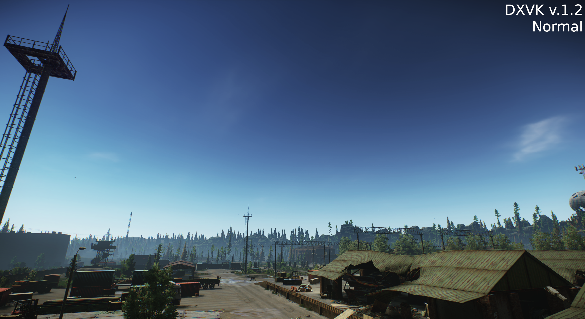
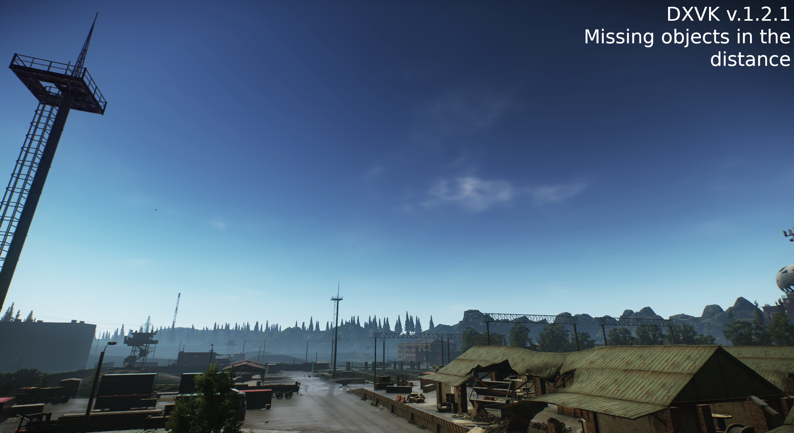

# Troubleshooting

Since there are many different Linux distributions out there, you might encounter issues with your specific installation. This section lists some commonly encountered issues and their solutions.

***

# Common issues

## Launcher

**
BSG Launcher not rendered correctly (Black window)
**

### Description

The BSG Launcher is not rendered correctly, only showing a black window. (Log shows `EGL_NOT_INITIALIZED`).

### Solution

Usually restarting the launcher (or installation script) "fixes" the issue.

**
BSG Launcher hanging after login
**

### Description

After logging in with the creditials, BSG Launcher hangs.

### Solution

Wait about a minute, then it should continue. If an error occurs, retry to login.

## In-game

**
Foliage not being rendered / LOD setting not working correctly (NVIDIA only)
**

### Description

Trees and bushes pop in / pop out or won't be rendered at a certain distance.

 

### Solution

As of April 3rd 2024 the bug has been fixed upstream with [this](https://github.com/doitsujin/dxvk/commit/f06c6463157c72d294720812c5d5445abf3ceb71) commit.
You can wait for the next release of DXVK (likely 2.3.2 or 2.4.x) or download the build artifact on [Github](https://github.com/doitsujin/dxvk/actions/runs/8539523872) (Account required).

**
Random crashes while in-raid or hideout
**

### Description

The game crashes while playing a raid or being in the hideout.

### Solution

This can indicate a problem with Tarkov running into the `vm.max_map_count` limit.

A detailed explaination of what this is can be found [here](https://stackoverflow.com/questions/5877797/how-does-mmap-work/5877961#5877961).

The recommended solution is to raise it to a 'safe' value of `1048576` e.g. by adding:

    vm.max_map_count=1048576

to `/etc/sysctl.conf` and run

    sudo sysctl -p

as stated [here](https://stackoverflow.com/a/50371108).

As of this year, [most common distros changed their default value](https://www.gamingonlinux.com/2024/04/arch-linux-changes-vmmax-map-count-to-match-fedora-ubuntu-for-better-gaming/) to the one stated above as well.

## Lutris installer script

**
Error code 256/512/1280
**

### Description

You can get different error codes at different steps throughout the installation process.

### Solution

It's hard to pinpoint the exact issue since many different apps use the same exit codes and there are many different tasks performed - but restarting the script usually help in this situation.

If the error persists after multiple tries, please [open up a bug report](https://dev.sp-tarkov.com/MadByte/Linux-Guide/issues/new) containing:

- A detailed description of the issue
- The task shown when the error happens (e.g. "`Installing game dependencies ...`" or "`Launching BSG Launcher ...`")
- If possible, try to take a screenshot or a short video of the issue
- When the lutris installer fails while showing "`Installing SPT-AKI ...`", please attach the log file e.g. found here:

      ~/Games/escape-from-tarkov/spt-linux-additions.log

## Manual installation

**
Aki.Launcher not launching / .NET Desktop Runtime not found
**

### Description

When launching AKI.Launcher, either one of two issues can occur: 
- A window pop-up appears which says that .NET Desktop Runtime is not installed.
**OR**
- Launcher not coming up and the lutris console log shows a semi-random error code e.g. `40960`

### Solution

1. Make sure .NET Desktop Runtime 6.0 is installed inside the wine prefix. You should find a `dotnet` folder at `WINEPREFIX/drive_c/Program Files/dotnet/` containing the `dotnet.exe` executable.
2. If it appears to be installed correctly, try to set no value for  `DOTNET_ROOT` and `DOTNET_BUNDLE_EXTRACT_BASE_DIR` in the environment variables for your wine application.

   - Bottles: `Settings` → `Environment variables`
   - Lutris: `Configure` → `System settings` → `Environment variables`

**
Error: "Failed to create D3D shaders"
**

### Description

When launching the game using Bottles, it crashes with the log message "Failed to create D3D shaders".

### Solution

Usually the error indicates that the dependency `d3dcompiler_47` is missing.

Either the bottle is not set up using the `Gaming` preset or Bottles failed to fetch required dependencies (e.g because no internet connection was available).

By default Bottles should install the following dependencies when using the `Gaming` preset:

`d3dx9`, `msls31`, `d3dcompiler_43`, `d3dcompiler_47`, `arial32`, `times32`, `courie32`.

- Make sure all dependencies are listed as installed at the bottom of `Options` → `Dependencies`. If not, install them manually and try again.

***

[Back to landing page](../README.md)