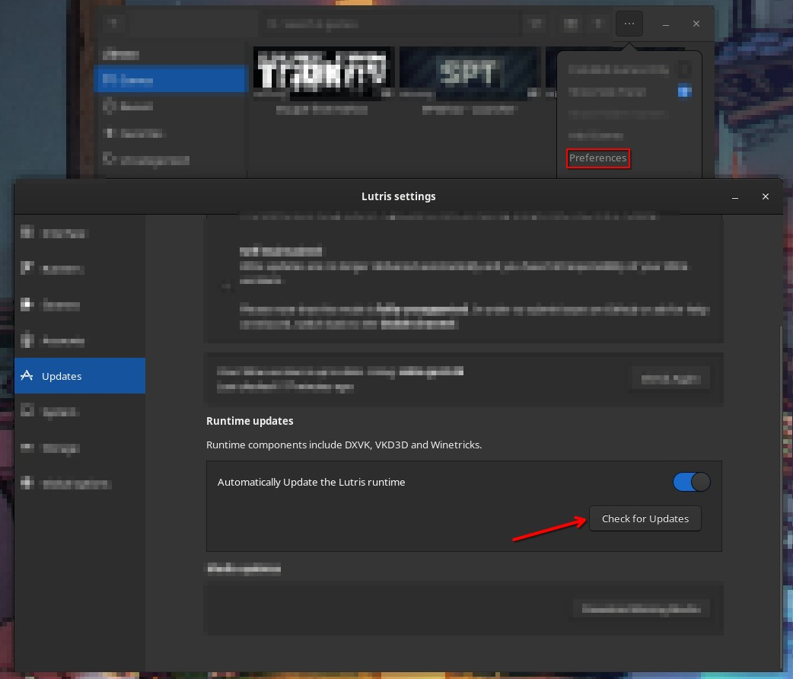

# Troubleshooting

Since there are many different Linux distributions out there, you might encounter issues with your specific installation. This section lists some commonly encountered issues and their solutions.

## Table of content

1. Launcher (BSG/SPT)
    - [1.1 Game crashing within seconds after launching](#11-game-crashing-within-seconds-after-launching)
    - [1.2 Missing fonts / icons](#12-missing-fonts--icons)

2. In-Game
    - [2.1 Random crashes while in-raid or hideout](#21-random-crashes-while-in-raid-or-hideout)
    - [2.2 Audio crackling/distortion issues](#22-audio-cracklingdistortion-issues)
    - [2.3 Long stutter/hang in-raid](#23-long-stutterhang-in-raid)

3. Lutris / Installer scripts
    - [3.1 Error code 256/512/1280/...](#31-error-code-2565121280)
    - [3.2 Issues on hardware with multiple GPUs (e.g. iGPU / dGPU)](#32-issues-on-hardware-with-multiple-gpus-eg-igpu--dgpu)
    - [3.3 SPT.Server keeps running in the background after closing it](#33-sptserver-keeps-running-in-the-background-after-closing-it)

4. Manual installation / Others
    - [4.1 SPT.Launcher not launching / .NET Desktop Runtime not found](#41-sptlauncher-not-launching--net-desktop-runtime-not-found)
    - [4.2 Error: Failed to create D3D shaders](#42-error-failed-to-create-d3d-shaders)
    - [4.3 SPT.Launcher & SPT.Server won't run at the same time](#43-sptlauncher--sptserver-wont-run-at-the-same-time)


## 1. Launcher

### 1.1 Game crashing within seconds after launching

**Description**

After clicking `Play`, the game briefly opens & closes shortly after.

**Solution**

Usually this means the DLL override for `winhttp` is missing!
Manually set `winhttp` to `n,b` in `Configure` > `Runner options` > `DLL Overrides`.

If the game worked previously & this happens after installing new mods, chances are you're running into issues with the mod(s). Check compatibilty of the mod with other mods as well as the installed SPT version.

[Back](#table-of-content)

***

### 1.2 Missing fonts / icons

**Description**

The BSG Launcher will not show correct fonts (Bender font family) for some text.

**Solution**

##### BSG Launcher

To fix fonts in the BSG Launcher, you can download & install the [Bender font](https://www.1001fonts.com/bender-font.html) on your distribution.

Unfortunately, this will not work when using a Proton runner for the application.

[Back](#table-of-content)

## 2. In-game

### 2.1 Random crashes while in-raid or hideout

**Description**

The game crashes while playing a raid or being in the hideout.

**Solution**

- Make sure you've `Swap` set up on your system. Tarkov will need at least some `Swap`, even on systems with a lot of RAM available.

- Another issue could be the `vm.max_map_count` limit (mostly on older distros).

    A detailed explaination of what that is can be found [here](https://thelinuxcode.com/using_mmap_function_linux/).

    The recommended solution is to raise it to a recommend value of `1048576` e.g. by adding:

        vm.max_map_count=1048576

    to `/etc/sysctl.conf` and run

        sudo sysctl -p

    as stated [here](https://stackoverflow.com/a/50371108).

    As of early 2024, [most common distros changed their default value](https://www.gamingonlinux.com/2024/04/arch-linux-changes-vmmax-map-count-to-match-fedora-ubuntu-for-better-gaming/) as well.

[Back](#table-of-content)

***

### 2.2 Audio crackling/distortion issues

**Description**

Sounds in the game are crackling / distorted.

**Solution**

In Lutris on the game shortcut, enable:
- `Configure` → `system options` → `Reduce PulseAudio latency`

That should fix the issue.

[Back](#table-of-content)

***

### 2.3 Long stutter/hang in-raid

**Description**

The game randomly hangs for ~3-5 seconds without RAM or VRAM being maxed out.

**Solution**

In Lutris on the game shortcut, enable:
- `Configure` → `system options` → `Disable Lutris Runtime`

That should reduce the stuttering significantly.

[Back](#table-of-content)

***


## 3. Lutris installer script

### 3.1 Error code 256/512/1280/...

**Description**

You can get different error codes at different steps throughout the installation process.

**Solution**

It's hard to pinpoint the exact issue since many different apps use the same exit codes and there are many different tasks performed. Try to keep game files and restart the script.

If the error persists after multiple attempts, please [open up a bug report](https://dev.sp-tarkov.com/MadByte/Linux-Guide/issues/new) containing:

- A detailed description of the issue
- The task shown when the error occurs (e.g. "`Installing game dependencies ...`" or "`Launching BSG Launcher ...`")
- If possible, try to take a screenshot or a short video of the issue
- If the Lutris installer fails while showing "`Installing SPT ...`", please attach the `spt-linux-additions.log` log file (usually found inside `~/.cache/spt-linux-additions`) to the bug report

#### Debugging installers

To get more details if something breaks, you can launch Lutris in debug mode using the following command in a terminal:

#### Native package: 
    lutris -d &> lutris.log
#### Flatpak:
    flatpak run net.lutris.Lutris -d &> lutris.log

This will generate a `lutris.log` file in your current or home directory.

#### Wine debugging

To debug issues that might be caused by Wine, you also need to enable debug logging for Wine:

- `Configure` → `Runner options` → `Output debugging info` → `Enabled`

That should enable wine logs in the console / output added to the `lutris.log` file.


[Back](#table-of-content)

***

### 3.2 Issues on hardware with multiple GPUs (e.g. iGPU / dGPU)

**Description**

The installation fails with the log containing something like:

```
X Error of failed request:  BadMatch (invalid parameter attributes)
  Major opcode of failed request:  156 (NV-GLX)
  Minor opcode of failed request:  43 ()
  Serial number of failed request:  149
  Current serial number in output stream:  150
```

**Solution**

It looks like there is an open [Nvidia/Wine bug report](https://bugs.winehq.org/show_bug.cgi?id=49407) that is working on fixing that issue.

You can try to `disable` your iGPU in your bios settings if possible. The corresponding option often is called `GFX/iGPU Multi-Monitor` or similar.

This should make sure that Lutris is seeing your discrete GPU only.

[Back](#table-of-content)

***

### 3.3 SPT.Server keeps running in the background after closing it

**Description**

When using Lutris 0.5.17 & running the `SPT.Server` via **Proton** (Proton ≠ Wine!), the server will keep running in the background after closing the window.

**Solution**

*(Updated 2024/12/23)*

It's a missing ""feature"" in Lutris.
It's possible to work around the issue by disabling `CLI mode` in the `system options` tab & changing/setting the value of the environment variable `PROTON_VERB` to `run`. This will launch the server window in a custom windows-like CMD window (without ANSI/color support).

[Back](#table-of-content)


## 4. Manual installation / Others

### 4.1 SPT.Launcher not launching / .NET Desktop Runtime not found

**Description**

When launching SPT.Launcher, either one of two issues can occur: 
- A window pop-up appears which says that .NET Desktop Runtime is not installed.
**OR**
- Launcher not coming up and the lutris console log shows a semi-random error code e.g. `40960`

**Solution**

Unfortunately, this can mean a bunch of things. Here's a check-list:

1. Make sure .NET Desktop Runtime 8.0 is installed inside the wine prefix. You should find a `dotnet` folder at `WINEPREFIX/drive_c/Program Files/dotnet/` containing the `dotnet.exe` executable.

2. Try to set no value for `DOTNET_ROOT` and `DOTNET_BUNDLE_EXTRACT_BASE_DIR` in the environment variables for your wine application.

   - Bottles: `Settings` → `Environment variables`
   - Lutris: `Configure` → `System options` → `Environment variables`

3. Sometimes the Lutris runtime or a wine runner can cause issues as well.

    - Check if the correct `wine version` is set for the game and the runner is working.
    - If that didn't help, you could try deleting the `runtime` directory in:

        - Flatpak: `~/.var/app/net.lutris.Lutris/data/lutris/runtime`
        - Native: `~/.local/share/lutris/runtime`

        & re-download the runtime from `Preferences` > `Updates`:

        

4. There's a rare issue sometimes with the `icu.dll` used by the prefix & some wine versions. Usually it will show a log entry mentioning `icu.dll` or `icuc` in the wine/proton log. You can try to disable the `icu.dll` in the `DLL overrides`:

    - Bottles: `Settings` → `DLL overrides`: Add key `icu`, select `disabled` as value & save the changes.
    - Lutris: `Configure` → `Runner options` → `DLL overrides`: Add key `icu`, value `d` & save the changes.

[Back](#table-of-content)

***

### 4.2 Error: Failed to create D3D shaders

**Description**

When launching the game using Bottles, it crashes with the log message "Failed to create D3D shaders".

**Solution**

Usually the error indicates that the dependency `d3dcompiler_47` is missing.

Either the bottle is not set up using the `Gaming` preset or Bottles failed to fetch required dependencies (e.g because no internet connection was available).

By default Bottles should install the following dependencies when using the `Gaming` preset:

`d3dx9`, `msls31`, `d3dcompiler_43`, `d3dcompiler_47`, `arial32`, `times32`, `courie32`.

- Make sure all dependencies are listed as installed at the bottom of `Options` → `Dependencies`. If not, install them manually and try again.

***

### 4.3 SPT.Launcher & SPT.Server won't run at the same time

**Description**

When using a Proton runner, only one application can be launched at a time. When trying to launch a second application inside the same prefix, it will quit instantly.

**Solution**

[This is the default behaviour](https://github.com/Open-Wine-Components/umu-launcher/wiki/Frequently-asked-questions-(FAQ)) for running games using Proton. You can override the behaviour by setting the environment variable `PROTON_VERB` to `run` before running the executable(s):

- Bottles: `Settings` → `Environment variables`
- Lutris: `Configure` → `System options` → `Environment variables`

[Back](#table-of-content)

***

[Up](#table-of-content) | [Back to landing page](../README.md)
