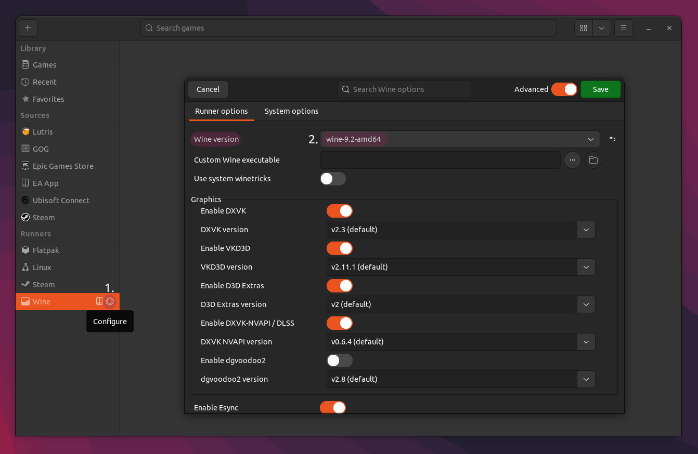

# SPT Lutris installer (Official)

> [!WARNING]
> This guide is currently **not compatible** with the Steam version of Escape From Tarkov

This *.yml script uses the regular windows installer to install SPT on your system.

## What you need

### - **~120GB free disk space**

### - **[Lutris](https://lutris.net/downloads)**
- Check if GPU and vulkan drivers are installed!
- [SPT Cover art](../../docs/lutris/cover_art.md) (Optional)
- Tested wine versions:
    - **[GE-Proton-10.x](https://github.com/GloriousEggroll/proton-ge-custom/releases)** (play only)
    - **[wine-kron4ek-10.17 amd64](https://github.com/Kron4ek/Wine-Builds/releases/tag/10.17)** (install & play)
        
### - **[SPT Lutris installer](../../installers/lutris-installer-official.yml) (*.yml)**

### - ASP.NET Runtime 9.0 ([How to install](../aspnet.md))

## Installation

**1. Installing Escape from Tarkov**

- First off, you need to install the game. Open Lutris and navigate to the `+` symbol in the top left corner. Select `Search for installer on Lutris website` and search for the game:

- Follow the steps shown inside the application, wait until the installation is finished & install the game client as usual.

> [!IMPORTANT]
> **You need to install the game client inside the launcher before continuing with the next step!**

**2. Preparing the wine runner**

> [!TIP]
> You can use [ProtonPlus](https://flathub.org/apps/com.vysp3r.ProtonPlus) or [ProtonUp-qt](https://davidotek.github.io/protonup-qt/) to install new wine versions in Lutris!

- Install your preferred wine version

- In Lutris, goto the `Runners` section, hover `Wine` & select `Configure`.

- Enable `Advanced` settings in the top right, then select your wine version & save the changes.

**3. Installing SPT**

- [Download](../../installers/lutris-installer-official.yml) the installer script.

- In Lutris, click the `+` in the top left, select `Install from a local install script` & navigate to the downloaded file:

- Now follow the steps & wait for the installation to complete.

**4. Running SPT**

> [!WARNING]
> We highly recommend switching from the default `wine-ge-8-26` runner in Lutris to a Proton version for better performance and an overall better experience.

Everything now is pretty much done, so now to run the game we need to run the server and the launcher.

- The server should launch automatically when using the `SPTarkov - Launcher` shortcut in Lutris. If not, you might be missing the required .NET runtime dependencies or your terminal emulator could not be found. To run the server manually, run the `SPT.Server.Linux` executable in a terminal.

> [!TIP]
> You also can add the server to Lutris by selecting `Add locally installed game`. Set `Linux` as runner & navigate to the `SPT.Server.Linux` executable in the `Game options`. You need to enable `CLI mode` in the `System options` to run the server in a terminal.

- To run the launcher, double click the `SPTarkov - Launcher` shortcut in Lutris or press the `Play` button at the bottom.

Have fun!

***
Still having issues? Visit our [issues section](../../docs/issues.md).

***

[Back to landing page](../../README.md)