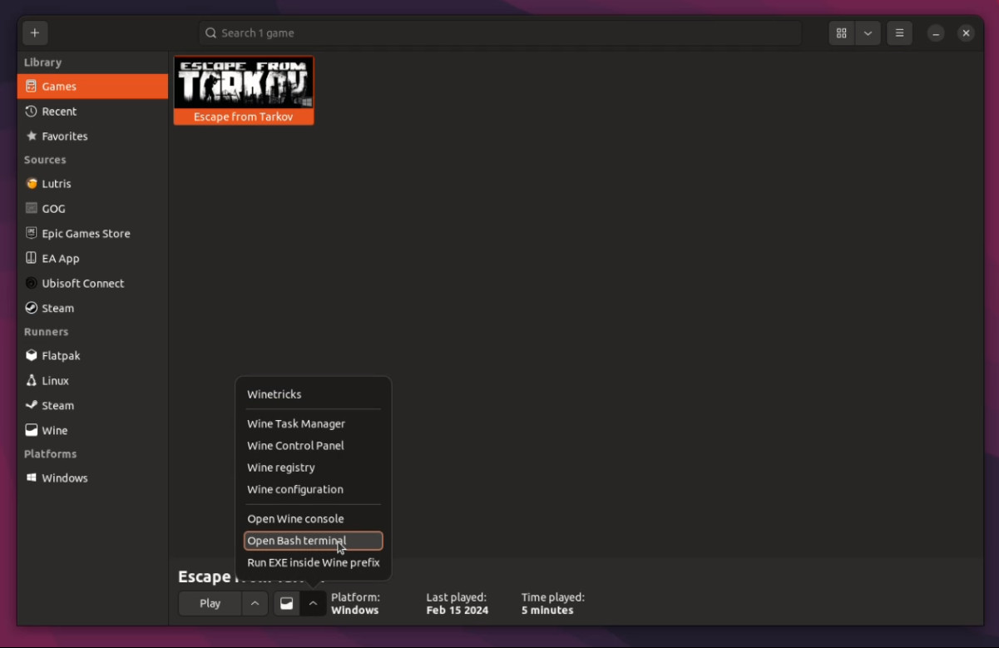
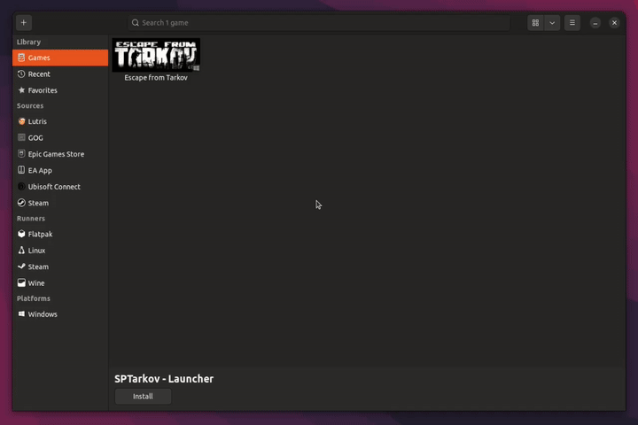

# SPT installation using Lutris

> [!WARNING]
> <span style="color:khaki">Never install SPT into your live EFT's game directory!</span>

## What you need

- **~120GB free disk space**

- **[Lutris](https://lutris.net/downloads)**
    - Make sure GPU and vulkan drivers are installed and working.

- **[SPT mod](https://hub.sp-tarkov.com/files/file/16-spt-aki/) (*.7z archive)**
    - Make sure to update to the latest EFT version and follow the [downpatching guide](../downpatching.md) if needed.
- [Cover art](../../docs/lutris/cover_art.md) (Optional)

To run the native Linux server you need the following packages installed on your system:

- **Ubuntu / Debian (based)**
    ```
    sudo apt install dotnet-runtime-9.0 aspnetcore-runtime-9.0
    ```

- **Fedora (based)**
    ```
    sudo dnf install dotnet-runtime-9.0 aspnetcore-runtime-9.0
    ```

- **Arch (based)**
    ```
    sudo pacman -S install dotnet-runtime aspnet-runtime
    ```

## Installation

<details>

**<summary>TL;DR version</summary>** 

1. Install EFT in `Lutris` using the installer script
2. Install game in `BSG Launcher`
3. Run `winetricks --self-update` via Lutris bash console
4. Run `winetricks -q arial times vcrun2022 dotnetdesktop8 dotnetdesktop9` via Lutris bash console
5. Copy `EFT game files` somewhere else inside the prefix and `downpatch` if needed
6. Unpack the `RELEASE-SPT-x.x.x.zip` archive into the `copied directory`
7. Duplicate config, new profile `SPTarkov - Launcher`
8. Change executable to `SPT.Launcher.exe` in `Configure` → `Game Settings`
9. In `Runner options`, add `winhttp=n,b` in the `DLL overrides` section
13. Run `SPTarkov.Server.Linux`, then `SPTarkov - Launcher`

</details>

***

**1. Installing LIVE EFT**

- First off, you need to install the game. Open Lutris and navigate to the `+` symbol in the top left corner. Select `Search for installer on Lutris website` and search for the game:


- Follow the steps shown inside the application, wait until the installation is finished

- Install the game client as usual.


**2. Preparing the prefix**

- Now we need to install some dependencies to the prefix. To do so, click on the wine glass on the bottom of the main Lutris window while the EFT game shortcut is selected → `Open Bash terminal`, and use the following commands:

      winetricks --self-update
      winetricks -q arial times vcrun2022 dotnetdesktop8 dotnetdesktop9 win81

    

**3. Downpatching & mod installation**

- Make a copy of your live EFT game files. You need to place it inside the same prefix, e.g at `/home/USER/Games/escape-from-tarkov/drive_c/SPTarkov`.

- If needed, downpatch EFT to the correct version e.g. by running the downgrade patcher inside the game directory. Check out our [downpatching guide](../downpatching.md).

- When it's done, extract the contents of the `RELEASE-SPT-x.x.x.zip` into your copied SPT game directory.


**4. SPT Launcher config**

- Back in Lutris, right-click the `Escape From Tarkov` shortcut and select `Duplicate`. We recommend renaming the duplicate to something like `"SPTarkov - Launcher"`.
  
- Now you'll need to select the correct executable e.g located at `YOUR_PREFIX/drive_c/SPTarkov/SPT.Launcher.exe`.

- Next in the `Runner options` → `DLL overrides` section, add the key `winhttp` with the value `n,b` and → `Save`.

    


**6. Running SPT**

Everything now is pretty much done, so now to run the game we need to run the server and the launcher.

- To run the server, run the `SPTarkov.Server.Linux` executable in a terminal.

> [!TIP]
> <span style="color:lightgreen">You can add the server to Lutris by selecting `Add locally installed game`. Set `Linux` as runner & navigate to the `SPTarkov.Server.Linux` executable in the `Game options`. You need to enable `CLI mode` in the `System options` to run the server in a terminal.</span>

- To run the launcher, double click the `SPTarkov - Launcher` shortcut in Lutris or press the `Play` button at the bottom.

Have fun!

***
Still having issues? Visit our [issues section](../../docs/issues.md).
***
[Back to landing page](../../README.md)


