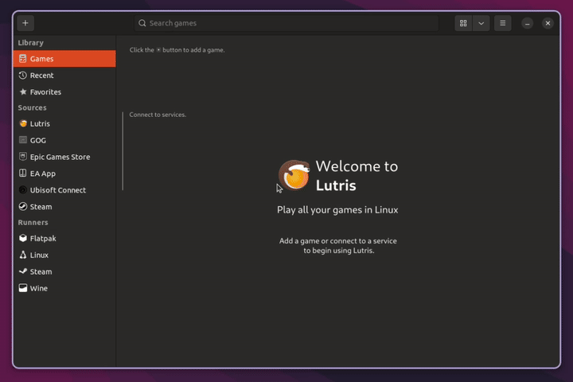
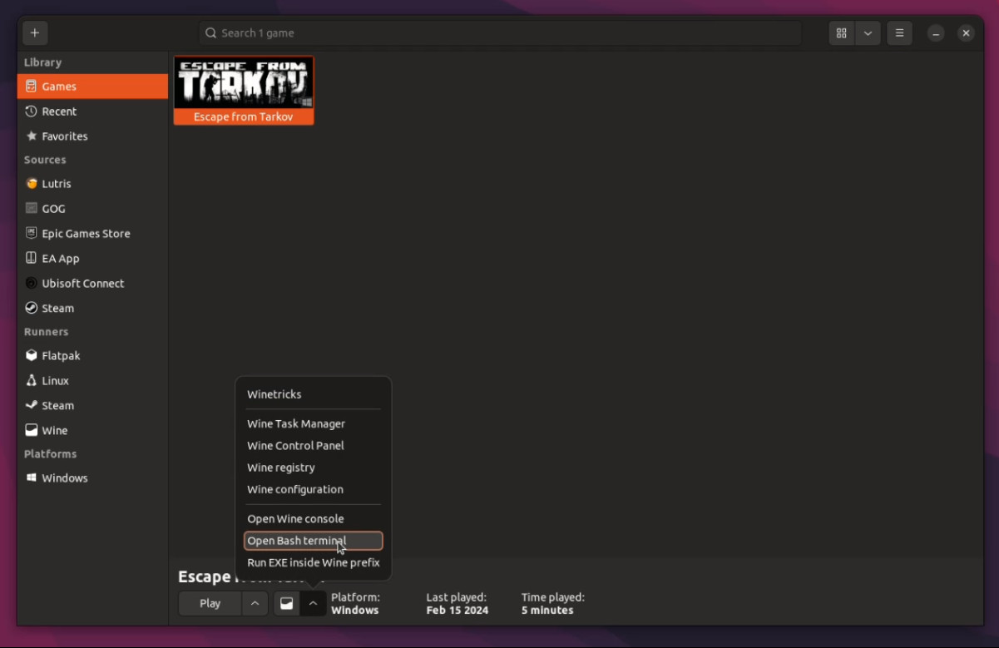

# SPT installation using Lutris

> [!WARNING]
> Never install SPT into your live EFT's game directory!

## What you need

### - **~150GB free disk space**

### - **[Lutris](https://lutris.net/downloads)**
- Make sure GPU and vulkan drivers are installed and working.
- [SPT Cover art](../../docs/lutris/cover_art.md) (Optional)
- **[SPT mod](https://github.com/sp-tarkov/build/releases/latest) (*.7z archive)**
    - Make sure to update to the latest EFT version and follow the [downpatching guide](../downpatching.md) if needed.

### - ASP.NET Runtime 10.0 ([How to install](../aspnet.md))

### - `webkit2gtk-4.1` system package installed

## Installation

**
TL;DR version
** 

1. Install EFT in `Lutris` using the installer script
2. Install game client inside the `BSG Launcher`
3. Run `winetricks -q arial times vcrun2022 dotnetdesktop9 dotnetdesktop10`
4. Copy `EFT game files` somewhere else and `downpatch` the game files if needed
5. Unpack the `RELEASE-SPT-x.x.x.zip` archive into the `copied directory`
6. Create new Linux runner shortcut `SPT - Server`
7. Set `SPT.Server.Linux` as executable & enable `CLI mode` in `Configure` → `System options`
8. Create new Linux runner shortcut `SPT - Launcher`
9. Set `SPT.Launcher.Linux` as executable
10. Add `WINEDLLOVERRIDES` with the value `winhttp=n,b` in `System options` → `Environment variables`
11. (Optional) Get the [server.sh](../../scripts/server.sh) script & set it as `pre-launch script` in `Configure` → `System options`

***

**1. Installing Escape from Tarkov**

- First off, you need to install the game. Open Lutris and navigate to the `+` symbol in the top left corner. Select `Search for installer on Lutris website` and search for the game:

    

- Follow the steps shown inside the application, wait until the installation is finished

- Install the game client as usual.

**2. Preparing the prefix**

- Now we need to install some dependencies to the prefix. To do so, click on the wine glass on the bottom of the main Lutris window while the EFT game shortcut is selected → `Open Bash terminal`, and use the following commands:

      winetricks -q arial times vcrun2022 dotnetdesktop9 dotnetdesktop10

    

**3. Downpatching & mod installation**

- Make a copy of your live EFT game files & paste the copy in your desired install location, e.g `~/Games`, then rename the directory to `SPT`.

- Downpatch the game files to the correct version by running the downgrade patcher inside the game directory. Check out our [downpatching guide](../downpatching.md).

- When it's done, extract the contents of the `RELEASE-SPT-x.x.x.zip` into the `SPT` directory.

**4. Configure SPT Launcher**

- Back in Lutris, navigate to the `+` symbol in the top left corner. Select `Add locally installed game` & set the `Runner` to `Linux`.
  
- Now you'll need to select the native launcher executable e.g located in `~/Games/SPT/SPT_Runtime/SPT.Launcher.Linux`.

- And lastly, add `WINEDLLOVERRIDES` with the value `winhttp=n,b` in `System options` → `Environment variables` & save the changes.

**5. Configure SPT Server**

- Once again, navigate to the `+` symbol in the top left corner. Select `Add locally installed game`  & set the `Runner` to `Linux`.
  
- Select `~/Games/SPT/SPT_Runtime/SPT.Server.Linux` as executable

- In `System options` enable `CLI mode` and ensure your default terminal is selected & save the changes.

**6. Running SPT**

Everything now is pretty much done. To run the game we need to run the server and the launcher.

- Run the `SPT - Server` shortcut in Lutris.

> [!TIP]
> In case the server doesn't show up after running it, you might be missing the `ASP.NET Runtime` package or you're using the `Flatpak version` of Lutris which can cause issues sometimes. Try switching to the native Lutris package or launch the server manually from a terminal.

- Run the `SPT - Launcher` shortcut in Lutris.

Have fun!

***
Still having issues? Visit our [issues section](../../docs/issues.md).
***

[Back to landing page](../../README.md)

