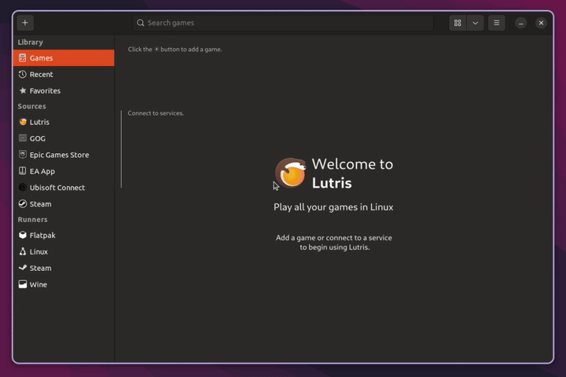
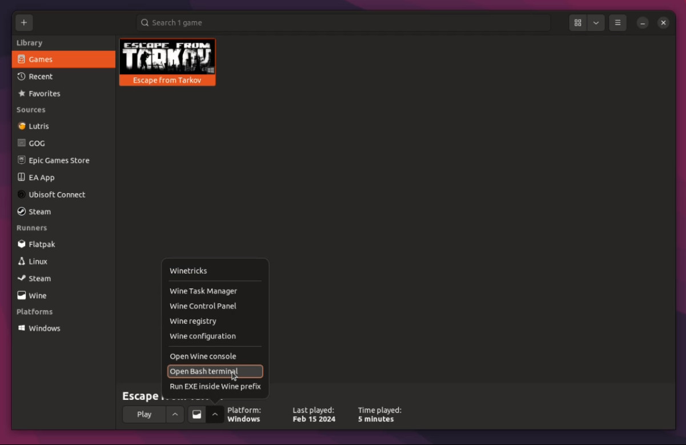
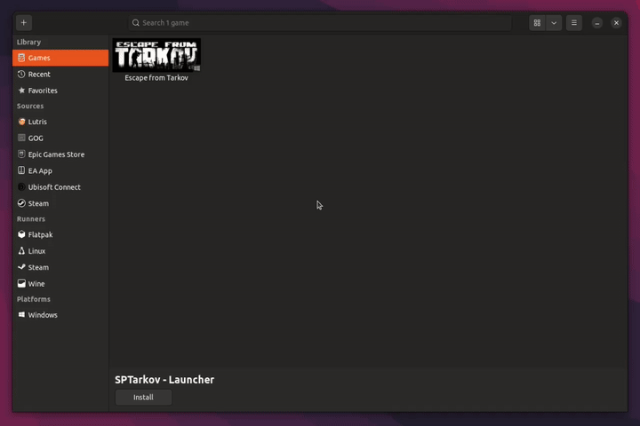

# SPT installation using Lutris

> [!WARNING]
> Never install SPT into your live EFT's game directory!

## What you need

- **~100GB free disk space**

- **[Lutris](https://lutris.net/downloads)**
    - If possible, get a native Lutris package (not Flatpak/Snap)!
        - For Ubuntu-based/Debian-based distros: You can find the latest release *.deb package [here](https://github.com/lutris/lutris/releases)!
    - Make sure you have all your [wine dependencies](https://github.com/lutris/docs/blob/master/WineDependencies.md) installed.
    - Make sure GPU and vulkan drivers are installed and working.

- **[SPT mod](https://hub.sp-tarkov.com/files/file/16-spt-aki/) (*.7z archive)**
    - Make sure to update to the latest EFT version and follow the [downpatching guide](./downpatching.md) if needed.

## Installation

**
TL;DR version
** 

1. Install EFT in `Lutris` using the installer script
2. Install game in `BSG launcher`
3. Run `winetricks --self-update` via Lutris bash console
4. Run `winetricks -q arial times vcrun2022 dotnetdesktop6 dotnetdesktop8 win81` via Lutris bash console
5. Copy `EFT game files` somewhere else inside the prefix and `downpatch` if needed
6. Unpack the `RELEASE-SPT-x.x.x.zip` archive into the `copied directory`
7. Duplicate config, new profile `SPTarkov Launcher`
8. Change executable to `SPT.Launcher.exe` in `Configure` → `Game Settings`
9. In `Runner options`, add `winhttp=n,b` in the `DLL overrides` section
10. Duplicate `SPTarkov Launcher` config, new profile is `SPTarkov Server`
11. Change executable to `SPT.Server.exe` in `Configure` → `Game Settings`
12. In `System options`, enable `CLI mode` for `SPT Server`
13. Run `SPTarkov Server`, then `SPTarkov Launcher`

***

**1. Installing LIVE EFT**

- First off, you need to install the game. Open Lutris and navigate to the `+` symbol in the top left corner. Select `Search for installer on Lutris website` and search for the game:

- Follow the steps shown inside the application, wait until the installation is finished

- Install the game client as usual.

**2. Preparing the prefix**

- Now we need to install some dependencies to the prefix. To do so, click on the wine glass on the bottom of the main Lutris window while the EFT game shortcut is selected → `Open Bash terminal`, and use the following commands:

      winetricks --self-update
      winetricks -q arial times vcrun2022 dotnetdesktop6 dotnetdesktop8 win81

    

**3. Downpatching & mod installation**

- Make a copy of your live EFT game files. You need to place it inside the same prefix, e.g at `/home/USER/Games/escape-from-tarkov/drive_c/SPTarkov`.

- If needed, downpatch EFT to the correct version e.g. by running the downgrade patcher inside the game directory. Check out our [downpatching guide](./downpatching.md).

- When it's done, extract the contents of the `RELEASE-SPT-x.x.x.zip` into your copied SPT game directory.

**4. SPT Launcher config**

- Back in Lutris, right-click the `Escape From Tarkov` shortcut and select `Duplicate`. We recommend renaming the duplicate to something like `"SPTarkov Launcher"`.
  
- Now you'll need to select the correct executable e.g located at `YOUR_PREFIX/drive_c/SPTarkov/SPT.Launcher.exe`.

- Next in the `Runner options` → `DLL overrides` section, add the key `winhttp` with the value `n,b` and → `Save`.

    

**5. SPT Server config**

- For the server shortcut we duplicate the `SPTarkov Launcher` shortcut instead of the EFT one. We recommend renaming the duplicate to something like `"SPTarkov Server"`.
  
- Again, select the executable e.g located at `YOUR_PREFIX/drive_c/SPTarkov/SPT.Server.exe`.

- Inside the `Configure` window go to the `System options` tab, toggle the `Advanced` switch in the top right, find the `CLI mode` option below and enable it, → `Save`.

**6. Voila!**

- If everything worked you should be able to launch the `SPTarkov Server`, followed by the `SPTarkov Launcher` & login.

- For better performance & additional fixes, we recommend using latest [GE-Proton](https://github.com/GloriousEggroll/proton-ge-custom/releases) or `wine-ge-8-26` for playing!

Have fun!

***
Still having issues? Visit our [issues section](../docs/issues.md).
***
[Back to landing page](../README.md)

