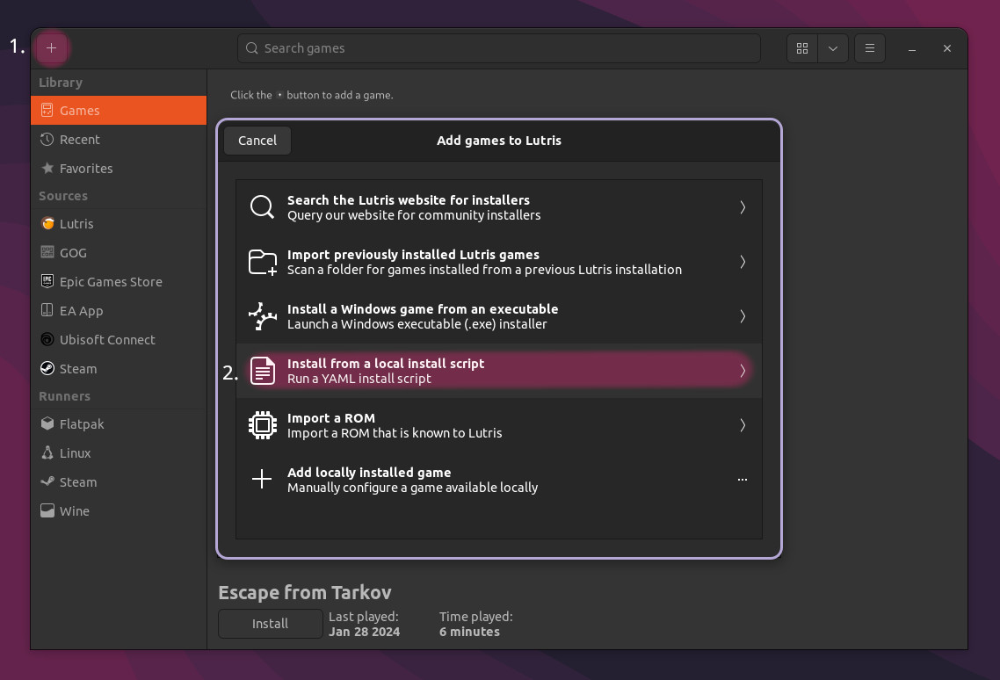

# SPT-AKI Lutris installer

This installer will automate most steps needed to install EFT & SPT-AKI.

## Importent notice

> ❗ Flatpak Lutris is not supported! ❗

> If you insist on using Flatpak, check out the [legacy Lutris installer script](../docs/lutris_installer_legacy.md) using the official SPT-AKI Installer

This Lutris installer uses a **custom** SPT-AKI installer script.

You can review the source code [here](../installers/spt-linux-additions).

**
More details
**

### Why using a custom installer script?

The initial reason for writting the script was to work around issues with the official `SPTInstaller` running through Wine.

There is a bug in most common Wine runners used by `Lutris` or `Bottles` that is causing the patching process to fail randomly. After some digging it turned out that there's one particular patch in `wine-staging` that causes this issue (`ntdll-SyscallEmulation`), so we compiled our own version of Wine without this patchset. This required the user to manually install a custom Wine runner in Lutris and use that globally for the installation.

To get rid of this extra step and also improve on stability and usability, we've began experimenting with patching game files on our own using `xdelta3` and the patch files included in the official patcher archive. Later, a custom installation script has been written as well.

### Are there any other advantages?

Yes! No longer having to rely on Wine to function correctly comes with quite some nice advantages:
- We can take advantage of [reflinking](https://btrfs.readthedocs.io/en/latest/Reflink.html) on supported filesystems (e.g. btrfs) when copying game files which can save a lot of time
- Patches don't necessarily need to be located inside the game directory (optional `SOURCE` argument)
- More helpful debug output possible (verbose / debug options set)
- and more...

### What about disadvantages?

This option also comes with some disadvantages that you might want to consider:
- No flatpak support!
- No standalone GUI - you either have to use the Lutris installer or the CLI to interact with the script.
- No official support on Discord or elsewhere by the mod developers
- Possibility of the script getting out-of-date at some point
- Probably more ...

## What you need

- ~100GB free disk space
- [Lutris](https://lutris.net/downloads) (Native)
    -
    - Check if you have all your [wine dependencies](https://github.com/lutris/docs/blob/master/WineDependencies.md) installed
    - Check if GPU and vulkan drivers are installed

- [SPT-AKI Lutris installer](../installers/lutris-installer-additions.yml) (*.yml)
    -

## Dependencies

### Ubuntu-based distros
    sudo apt-get install p7zip xxd

### Arch-based distros
    sudo pacman -S p7zip xxd

### Fedora
    sudo yum install p7zip-plugins xdelta vim-common

## Notes
- The `BSG Launcher` can have some issues on Linux. If it shows a black window - restart the script without deleting the game files

## Installation

1. Run the `SPT-AKI Lutris installer` script:

    

2. Wait until the `BSG Launcher` shows up, → `login`, then either:
    - press `Download` in the launcher
    
    **OR**
    - copy/paste an existing **VANILLA** game installation into the prefix, e.g `/home/USER/Games/escape-from-tarkov/Battlestate Games/Escape from Tarkov`, select `set the path to existing game installation` in the launcher & wait until the file verification is completed.

5. After EFT has been successfully installed, close the `BSG Launcher` to proceed.

    >Sometimes the `Bsg Launcher` returns an error when being closed for no appearend reason.
    Make sure to keep the game files when asked by Lutris & retry running the script

6. Wait for the installer script to complete
7. If everything worked you should be able to launch the `SPTarkov - Server`, followed by `SPTarkov - Launcher` & login.

Have fun!

***
Still having issues? Visit our [issues section](../docs/issues.md).

***
[Back to landing page](../README.md)