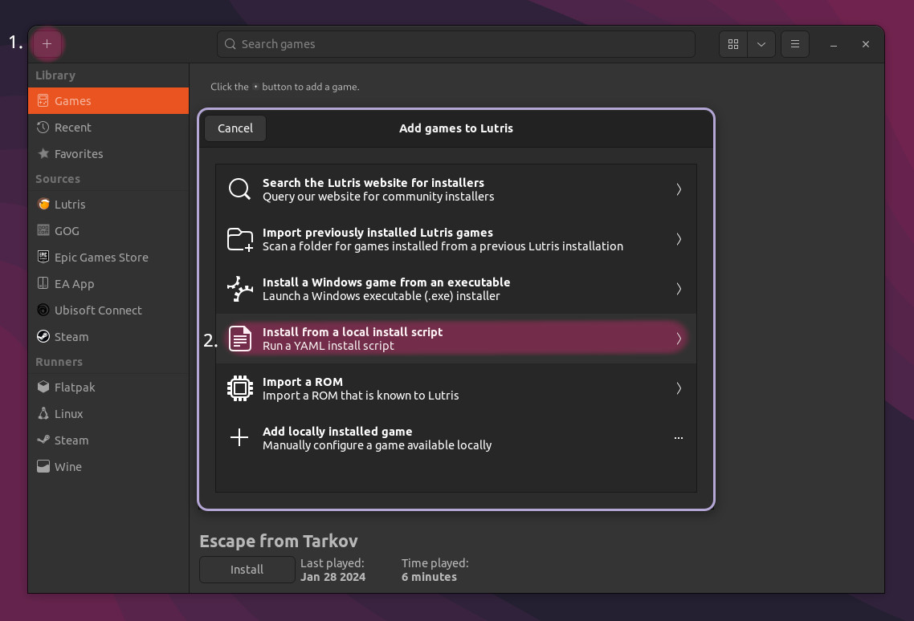

# SPT Lutris installer (Additions)

This *.yml script uses a **custom**, native Linux install script.

You can review the source code [here](../installers/spt-linux-additions).

**
More details
**

### Why using a custom installer script?

The initial reason for writting the script was to work around issues with the official `SPTInstaller` running through Wine.

There is a bug in most common Wine runners used by `Lutris` or `Bottles` that is causing the patching process to fail randomly. To work around this, the user needs to manually install a custom Wine runner in Lutris and use it globally for the installation.

To get rid of this extra step and also improve on stability and usability, we began experimenting with patching game files on our own using `xdelta3` and the patch files included in the official patcher archive. Later, a custom installation script has been written as well.

### What are the advantages?

- Faster, more stable installation process
- Additional features, e.g.:
    - Native installer & patcher in a single script
    - Support for [reflinking](https://btrfs.readthedocs.io/en/latest/Reflink.html) on supported filesystems (e.g. btrfs)
    - Reinstall mode - creates a backup of user files and reinstalls the latest SPT version
    - **WIP**: Create & restore user backups using CLI commands

### What about disadvantages?

- No standalone GUI - you either have to use the Lutris installer or the CLI to interact with the script.
- No official support on Discord or elsewhere by the mod developers

## What you need

- **~100GB free disk space**
- **[Lutris](https://lutris.net/downloads)**
    - Check if you have all your [wine dependencies](https://github.com/lutris/docs/blob/master/WineDependencies.md) installed
    - Check if GPU and vulkan drivers are installed
- **[SPT Lutris installer](../installers/lutris-installer-additions.yml) (*.yml)**
    

## Dependencies

#### Ubuntu-based distros
`sudo apt-get install p7zip xxd`

#### Arch-based distros
`sudo pacman -S p7zip xxd`

#### Fedora
`sudo dnf install p7zip-plugins vim-common`

## Installation

1. **Installing Escape from Tarkov**

    First off, you need to install the game. Open Lutris and navigate to the `+` symbol in the top left corner. Select `Search for installer on Lutris website` and search for the game:

    

    Follow the steps shown inside the application, wait until the installation is finished & install the game client as usual.

> [!IMPORTANT]
> **You need to install the game client inside the launcher before continuing with the next step!**

2. **Installing SPT**

    [Download](https://github.com/MadByteDE/SPT-Linux-Guide/blob/addon_installer/installers/lutris-installer-additions.yml) the installer script.

    In Lutris, click the `+` in the top left, select `Install from a local install script` & navigate to the downloaded file:

    

    Now follow the steps & wait for the installation to complete.

    If everything worked you should be able to launch the `SPTarkov - Server`, followed by `SPTarkov - Launcher` & login.

    > [!TIP]
    > For better performance & additional fixes, we recommend switching to latest [GE-Proton](https://github.com/GloriousEggroll/proton-ge-custom/releases) or `wine-ge-8-26` for playing!

***
Still having issues? Visit our [issues section](../docs/issues.md).

***
[Back to landing page](../README.md)