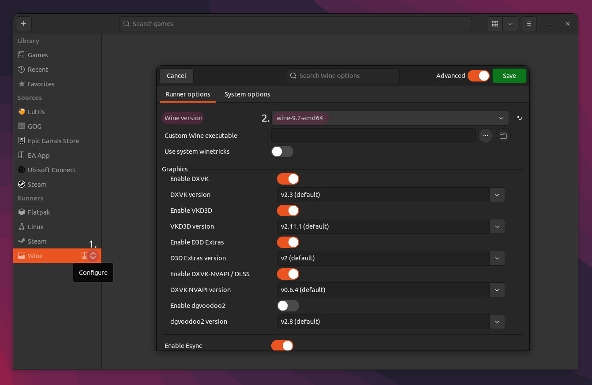

# SPT-AKI Lutris installer

This installer will automate most steps needed to install EFT & SPT-AKI.

> For the updated Lutris installer using our **custom** SPT-AKI Installer script - go [here](../docs/lutris_installer.md).

## What you need

- ~100GB free disk space
- [Lutris](https://lutris.net/downloads)
    -
    - Check if you have all your [wine dependencies](https://github.com/lutris/docs/blob/master/WineDependencies.md) installed.
    - Check if GPU and vulkan drivers are installed!

- [SPT-AKI Lutris installer](../installers/lutris-installer-official.yml) (*.yml)
    -
- [Wine-Staging-SPT build](https://dev.sp-tarkov.com/MadByte/Linux-Guide/releases) (*.tar.xz)
    -
    - install instructions can be found in the description on the `Releases` page.
    - Alternatively, you can try to use a vanilla `wine-stable` build

## Notes

- The `BSG Launcher` can have some issues on Linux. If it crashes or freezes - restart the script!
- The default `wine-ge-xx-x` runner won't work for the installation! Use the one in the `Releases` section or use another `wine-stable` runner (`wine-staging` without the fix won't work either)

## Installation

1. Install the downloaded `Wine-Staging-SPT` runner in Lutris.

2. Launch `Lutris` and set **global** `wine version` to the installed runner → `Save`.

    >This is a temporary workaround required for `AKIPatcher` to not fail while applying patches and can be reverted after the installation is completed.

    

3. Run the `SPT-AKI Lutris installer` script:

    

    >Make sure to create a **new prefix**! Using a prefix created with another Wine versions will cause issues! 

4. Wait until `BSG Launcher` shows up, → `login`, then either:
    - press `Download` in the launcher
    
    **OR**
    - copy/paste an existing **VANILLA** game installation into the prefix, e.g `/home/USER/Games/escape-from-tarkov/Battlestate Games/`, select `set the path to existing game installation` in the launcher & wait until the file verification is completed.

5. After EFT has been successfully installed, close the `BSG Launcher` to proceed.
6. Wait until `SPTInstaller` launches, follow the instructions shown & close it when it's done.
7. If everything worked you should be able to launch the `SPTarkov - Server`, followed by `SPTarkov - Launcher` & login.

Have fun!

***
Still having issues? Visit our [issues section](../docs/issues.md).

***
[Back to landing page](../README.md)