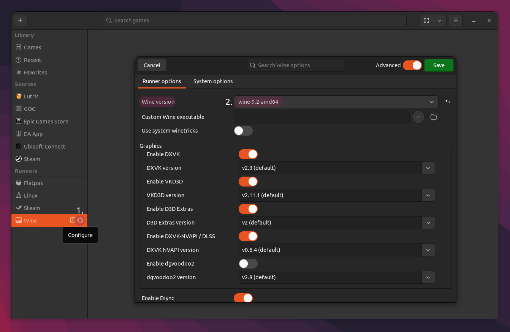

# SPT Lutris installer (Official)

> [!TIP]
> You can use `protonup-qt` to install new wine versions in Lutris!

This *.yml script uses the regular windows installer to install SPT on your system.

## What you need

- **~100GB free disk space**
- **[Lutris](https://lutris.net/downloads)**
    - Check if you have all your [Wine dependencies](https://github.com/lutris/docs/blob/master/WineDependencies.md) installed.
    - Check if GPU and vulkan drivers are installed!
- **[SPT Lutris installer](../installers/lutris-installer-official.yml) (*.yml)**
- **Wine**: The default wine runner (wine-ge-8-26-x86_64) will not run the `SPTInstaller` executable!
    - We recommend [Kron4ek vanilla wine-9.19-amd64](https://github.com/Kron4ek/Wine-Builds/releases/tag/9.19) for the installation! (can be changed back afterwards)

## Notes

- Sometimes the `Bsg Launcher` can return an error when being closed, resulting in the installation to fail. Make sure to keep all game files when asked by Lutris & retry running the script
- It's possible that the EFT client launches during the installation in the `BSG Launcher`. You can close it e.g. using `Alt+F4` to continue with the installation process

## Installation

1. **Installing Escape from Tarkov**

    First, you will need to install Escape from Tarkov in Lutris. You can search for `Escape from Tarkov` inside the application or click the button below to launch the Installer automatically:

    [![EFT_install]][Link1]

    [Link1]: lutris:escape-from-tarkov-official

    [EFT_install]: https://img.shields.io/badge/Install_EFT-EF2D5E?style=for-the-badge&logoColor=white&logo=Lutris

    > [!IMPORTANT]
    > **You need to install the game client inside the BSG Launcher before continuing with the next step!**

2. **Preparing the wine runner**

    Launch `Lutris` and set the **global** `Wine version` to your custom `Wine` version:

    

    To use a custom Wine version, enable `Advanced` settings in the top right, then select `Custom` in the drop-down menu & navigate to the `wine` executable in the extracted Wine directory, e.g. :
    
            ~/Downloads/wine-9.19-amd64/bin/wine64

    Now, save the changes.

3. **Installing SPTarkov**

    To use the custom SPT installer, download the script:
    
    [![SPT_install]][Link2]

    [Link2]: https://github.com/MadByteDE/SPT-Linux-Guide/blob/addon_installer/installers/lutris-installer-additions.yml

    [SPT_install]: https://img.shields.io/badge/Download_Installer-EF2D5E?style=for-the-badge&logoColor=white&logo=Lutris
    
    Then open Lutris, click the `+` in the top left, select `Install from a local install script` & navigate to the downloaded **.yml** installer file:
    
5. **Wait until `SPTInstaller` launches, follow the instructions shown & close it when it's done.**

    > [!TIP]
    > For better performance & additional fixes, we recommend using latest [GE-Proton](https://github.com/GloriousEggroll/proton-ge-custom/releases) or `wine-ge-8-26` for playing!

    - If everything worked you should be able to launch the `SPTarkov - Server`, followed by `SPTarkov - Launcher` & login.

    Have fun!

***
Still having issues? Visit our [issues section](../docs/issues.md).

***
[Back to landing page](../README.md)